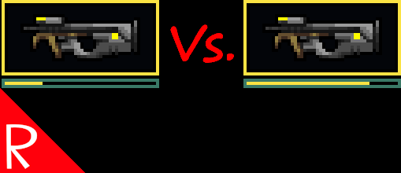

# Quasimorph Decrease Weapons Degradation

This repo is temporary until the Steam Version can be worked out with the original author.  It may be deleted.

Reduces the durability loss of weapons by 50%.  The reduction multiplier can be set in the mod's configuration file.

# Credit

This is the Steam Workshop version of Elija's "Decrease Weapons Degradation" mod.

# Configuration

The configuration file will be created on the first game run and can be found at `%AppData%\..\LocalLow\Magnum Scriptum Ltd\Quasimorph_ModConfigs\DecreaseWeaponsDegradation\config.json`.

|Name|Default|Description|
|--|--|--|
|WeaponsDegradationMultiplier|.5|The multiplier applied to durability loss.  Ex:  .25 would reduce the durability loss by 1/4|

# Source Code
Source code is available on GitHub at https://github.com/NBKRedSpy/DecreaseWeaponsDegradation
